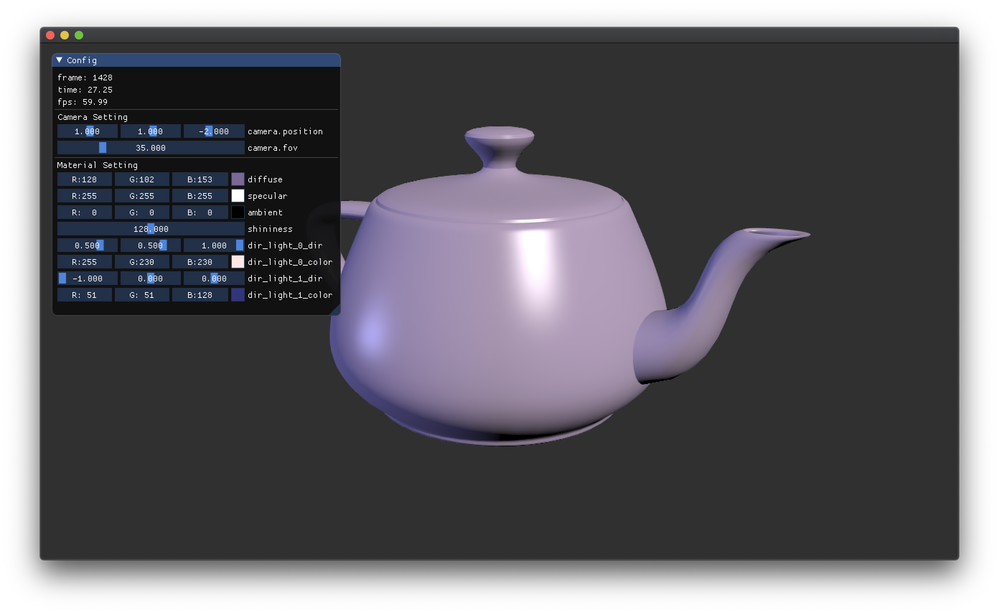

# bigger

bigg (bgfx + imgui + glfw + glm) + utils

This library, named `bigger`, is a prototype-oriented middleware library for 3D interactive applications. Based on a library named `bigg`, which stands for `bgfx` + `imgui` + `glfw` + `glm`, this library adds some higher-level utilities (such as renderable primitive classes) to make the prototyping of lightweight and cross-platform apps even easier.

## Languages

- C++17
- GLSL 1.30

## Dependencies

- bigg <https://github.com/JoshuaBrookover/bigg> [Unlicense]
  - bgfx.cmake <https://github.com/JoshuaBrookover/bgfx.cmake> [CC0 1.0 Universal]
    - bgfx <https://github.com/bkaradzic/bgfx> [BSD 2-Clause]
    - bimg <https://github.com/bkaradzic/bimg> [BSD 2-Clause]
    - bx <https://github.com/bkaradzic/bx> [BSD 2-Clause]
  - Dear ImGui <https://github.com/ocornut/imgui> [MIT]
  - GLFW <https://github.com/glfw/glfw> [Zlib]
  - GLM <https://github.com/g-truc/glm> [MIT]
- random-util <https://github.com/yuki-koyama/rand-util> [MIT]
- string-util <https://github.com/yuki-koyama/string-util> [MIT]
- tinyobjloader <https://github.com/syoyo/tinyobjloader> [MIT]

## Main Classes

- App __(needs to be overridden)__
- Camera
- Primitives
  - Cube primitive
  - Dynamic mesh primitive
  - Mesh primitive
  - Plane primitive
  - Sphere primitive
- Materials
  - Blinn-Phong material

## App Event Cycle

- `bigger::App::runApp()`
  - `glfw` initialization
  - `bgfx` initialization
  - `imgui` initialization
  - Reset
  - `bigger::App::initialize()` __(needs to be overridden)__
  - Main loop
    - `glfw` event polling
    - `imgui` event polling
    - `bigg::Application::update()`
      - `bigger::App::update()` __(needs to be overridden)__
      - Update scene objects (`bigger::SceneObject::update()`)
      - Render scene objects (`bigger::SceneObject::draw()`)
    - `imgui` render
    - `bgfx` submit
  - `bigger::App::shutdown()`
    - Release scene objects
    - `bigger::App::releaseSharedResources()` __(needs to be overridden)__
  - `imgui` shutdown
  - `bgfx` shutdown
  - `glfw` shutdown

## App Design

- Always two directional lights
  - Other types of lights or more than two directional lights are not supported
- Intensive use of smart pointers
  - Primitives and materials need to be dynamically instantiated and managed by smart pointers (i.e., either `std::shared_ptr<T>` or `std::unique_ptr<T>`)

## Usage

### Override App Class

The following three methods need to be overridden by the new app class:

- `bigger::App::initialize()`: E.g., initializing the app and instantiating necessary objects living through the app life.
- `bigger::App::update()`: E.g., writing frame-wise update rules and calling `imgui` draw calls.
- `bigger::App::releaseSharedResources()`: E.g., releasing shared resources maintained by the app class (such as vertex buffers).

### (TODO)

## License

MIT License

## Contribution

Issue reports & pull requests are highly welcomed.
